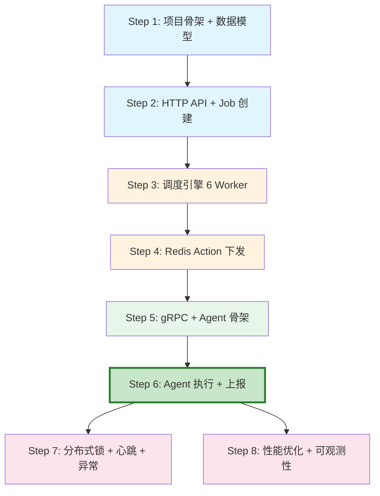

# TBDS 简化版管控平台 — 分步实现路线图

> **文档定位**：本文档为项目的**渐进式实现指南**，将整个系统拆分为 8 个可独立部署、可体验的步骤。
> 每完成一个步骤，你都能启动项目并看到实际效果，逐步从"骨架"演进到"完整系统"。
> **核心原则**：每一步都能 `go run` 起来，每一步都有可验证的功能。

---

## 目录

- [总览：8 步实现路线图](#总览8-步实现路线图)
- [Step 1：项目骨架 + 数据模型 + 建表](#step-1项目骨架--数据模型--建表)
- [Step 2：HTTP API + Job 创建（能创建任务了）](#step-2http-api--job-创建能创建任务了)
- [Step 3：调度引擎核心（任务能自动流转了）](#step-3调度引擎核心任务能自动流转了)
- [Step 4：Redis Action 下发（任务能缓存到 Redis 了）](#step-4redis-action-下发任务能缓存到-redis-了)
- [Step 5：gRPC 服务 + Agent 骨架（Server-Agent 能通信了）](#step-5grpc-服务--agent-骨架server-agent-能通信了)
- [Step 6：Agent 命令执行 + 结果上报（端到端跑通了）](#step-6agent-命令执行--结果上报端到端跑通了)
- [Step 7：分布式锁 + 心跳 + 异常处理（生产级可靠性）](#step-7分布式锁--心跳--异常处理生产级可靠性)
- [Step 8：性能优化 + 可观测性（面试加分项）](#step-8性能优化--可观测性面试加分项)
- [附录：每步验证清单](#附录每步验证清单)

---

## 总览：8 步实现路线图

```
Step 1 ─── 项目骨架 + 数据模型 ──────────────────── 能编译、能建表
  │
Step 2 ─── HTTP API + Job 创建 ──────────────────── 能通过 curl 创建 Job
  │
Step 3 ─── 调度引擎（6 Worker） ─────────────────── Job→Stage→Task→Action 自动流转
  │
Step 4 ─── Redis Action 下发 ────────────────────── Action 从 DB 加载到 Redis
  │
Step 5 ─── gRPC 服务 + Agent 骨架 ───────────────── Agent 能拉取到 Action
  │
Step 6 ─── Agent 执行 + 结果上报 ────────────────── 端到端：创建 Job → 执行命令 → 完成
  │
Step 7 ─── 分布式锁 + 心跳 + 异常处理 ──────────── 多实例部署、超时重试、高可用
  │
Step 8 ─── 性能优化 + 可观测性 ──────────────────── 批量聚合、覆盖索引、Prometheus 指标
```

### 时间估算

| 步骤 | 预计耗时 | 累计 | 可体验功能 |
|------|---------|------|-----------|
| Step 1 | 1 天 | 1 天 | 编译通过、数据库建表、模块管理框架 |
| Step 2 | 1-2 天 | 2-3 天 | curl 创建 Job，查询 Job 状态 |
| Step 3 | 2-3 天 | 4-6 天 | Job 自动编排为 Stage→Task→Action |
| Step 4 | 1 天 | 5-7 天 | Redis 中能看到 Action 缓存 |
| Step 5 | 1-2 天 | 6-9 天 | Agent 启动后能拉取到 Action |
| Step 6 | 1-2 天 | 7-11 天 | **端到端跑通**：创建 Job → 执行 → 完成 |
| Step 7 | 2-3 天 | 9-14 天 | 多 Server 实例、超时检测、失败重试 |
| Step 8 | 2-3 天 | 11-17 天 | 性能指标、Prometheus 监控 |

> **建议**：Step 1-6 是核心路径（约 1.5 周），完成后系统已经端到端可用。Step 7-8 是锦上添花。

---

## Step 1：项目骨架 + 数据模型 + 建表

### 1.1 目标

搭建项目基础框架，实现模块生命周期管理，完成数据库建表。

### 1.2 完成后能做什么

```bash
# 编译通过
go build ./cmd/server/
go build ./cmd/agent/

# 启动 Server（连接 MySQL + Redis，打印日志后退出）
./server -c configs/server.ini

# 数据库中能看到 6 张表
mysql> SHOW TABLES;
+---------------------+
| job                 |
| stage               |
| task                |
| action              |
| host                |
| cluster             |
+---------------------+
```

### 1.3 需要实现的内容

#### 1.3.1 目录结构

```
tbds-simplified/
├── cmd/
│   ├── server/main.go          # Server 入口（初始化模块 → 启动 → 等待信号 → 销毁）
│   └── agent/main.go           # Agent 入口（暂时只打印 "Agent started"）
├── internal/
│   └── models/
│       ├── job.go              # Job GORM 模型
│       ├── stage.go            # Stage GORM 模型
│       ├── task.go             # Task GORM 模型
│       ├── action.go           # Action GORM 模型
│       ├── host.go             # Host GORM 模型
│       ├── cluster.go          # Cluster GORM 模型
│       └── constants.go        # 状态常量（Init=0, Running=1, Success=2, Failed=-1...）
├── pkg/
│   ├── config/config.go        # INI 配置加载
│   ├── db/mysql.go             # GormModule（Create/Start/Destroy）
│   ├── cache/redis.go          # RedisModule（Create/Start/Destroy）
│   ├── logger/logger.go        # LogModule
│   └── module/
│       └── module_manager.go   # ModuleManager（按顺序 Create → Start → Destroy）
├── sql/schema.sql              # 建表 SQL（含索引）
├── configs/
│   ├── server.ini
│   └── agent.ini
├── go.mod
└── Makefile
```

#### 1.3.2 核心代码：Module 接口

```go
// pkg/module/module_manager.go

type Module interface {
    Name() string
    Create(config *config.Config) error
    Start() error
    Destroy() error
}

type ModuleManager struct {
    modules []Module
}

func (mm *ModuleManager) Register(m Module) {
    mm.modules = append(mm.modules, m)
}

// 按注册顺序依次 Create → Start
func (mm *ModuleManager) StartAll(cfg *config.Config) error {
    for _, m := range mm.modules {
        if err := m.Create(cfg); err != nil {
            return fmt.Errorf("module %s create failed: %w", m.Name(), err)
        }
    }
    for _, m := range mm.modules {
        if err := m.Start(); err != nil {
            return fmt.Errorf("module %s start failed: %w", m.Name(), err)
        }
    }
    return nil
}

// 按注册逆序 Destroy
func (mm *ModuleManager) DestroyAll() {
    for i := len(mm.modules) - 1; i >= 0; i-- {
        mm.modules[i].Destroy()
    }
}
```

#### 1.3.3 核心代码：Server main.go

```go
// cmd/server/main.go

func main() {
    cfg := config.Load("configs/server.ini")

    mm := module.NewModuleManager()
    mm.Register(logger.NewLogModule())
    mm.Register(db.NewGormModule())
    mm.Register(cache.NewRedisModule())

    if err := mm.StartAll(cfg); err != nil {
        log.Fatalf("Server start failed: %v", err)
    }
    log.Info("Server started successfully")

    // 等待退出信号
    quit := make(chan os.Signal, 1)
    signal.Notify(quit, syscall.SIGINT, syscall.SIGTERM)
    <-quit

    log.Info("Server shutting down...")
    mm.DestroyAll()
}
```

#### 1.3.4 数据模型示例：Action

```go
// internal/models/action.go

type Action struct {
    ID                int64     `gorm:"primaryKey;autoIncrement"`
    ActionID          string    `gorm:"column:action_id;uniqueIndex:uk_action_id"`
    TaskID            int64     `gorm:"column:task_id;index:idx_action_task"`
    StageID           string    `gorm:"column:stage_id"`
    JobID             int64     `gorm:"column:job_id"`
    ClusterID         string    `gorm:"column:cluster_id"`
    HostUUID          string    `gorm:"column:hostuuid;index:idx_action_host"`
    IPv4              string    `gorm:"column:ipv4"`
    CommandCode       string    `gorm:"column:commond_code"`
    CommandJSON       string    `gorm:"column:command_json;type:text"`
    ActionType        int       `gorm:"column:action_type"`
    State             int       `gorm:"column:state;index:idx_action_state"`
    ExitCode          int       `gorm:"column:exit_code"`
    ResultState       int       `gorm:"column:result_state"`
    Stdout            string    `gorm:"column:stdout;type:text"`
    Stderr            string    `gorm:"column:stderr;type:text"`
    DependentActionID int64     `gorm:"column:dependent_action_id"`
    SerialFlag        string    `gorm:"column:serial_flag"`
    CreateTime        time.Time `gorm:"column:createtime;autoCreateTime"`
    UpdateTime        time.Time `gorm:"column:updatetime;autoUpdateTime"`
    EndTime           *time.Time `gorm:"column:endtime"`
}

func (Action) TableName() string { return "action" }
```

#### 1.3.5 建表 SQL（关键部分）

```sql
-- sql/schema.sql

CREATE TABLE IF NOT EXISTS `action` (
    `id` BIGINT(20) NOT NULL AUTO_INCREMENT,
    `action_id` VARCHAR(128) NOT NULL,
    `task_id` BIGINT(20) DEFAULT NULL,
    `stage_id` VARCHAR(128) DEFAULT NULL,
    `job_id` BIGINT(20) DEFAULT NULL,
    `cluster_id` VARCHAR(128) DEFAULT NULL,
    `hostuuid` VARCHAR(128) DEFAULT NULL,
    `ipv4` VARCHAR(64) DEFAULT NULL,
    `commond_code` VARCHAR(128) DEFAULT NULL,
    `command_json` TEXT,
    `action_type` INT(11) DEFAULT 0,
    `state` INT(11) DEFAULT 0,
    `exit_code` INT(11) DEFAULT NULL,
    `result_state` INT(11) DEFAULT NULL,
    `stdout` TEXT,
    `stderr` TEXT,
    `dependent_action_id` BIGINT(20) DEFAULT NULL,
    `serial_flag` VARCHAR(128) DEFAULT NULL,
    `createtime` DATETIME DEFAULT CURRENT_TIMESTAMP,
    `updatetime` DATETIME DEFAULT CURRENT_TIMESTAMP ON UPDATE CURRENT_TIMESTAMP,
    `endtime` DATETIME DEFAULT NULL,
    PRIMARY KEY (`id`),
    UNIQUE KEY `uk_action_id` (`action_id`),
    KEY `idx_action_state` (`state`),
    KEY `idx_action_task` (`task_id`),
    KEY `idx_action_host` (`hostuuid`)
) ENGINE=InnoDB DEFAULT CHARSET=utf8mb4;
```

### 1.4 验证方式

```bash
# 1. 编译
make build

# 2. 建表
mysql -u root -p < sql/schema.sql

# 3. 启动 Server
./bin/server -c configs/server.ini
# 预期输出：
# [INFO] LogModule started
# [INFO] GormModule started - connected to MySQL
# [INFO] RedisModule started - connected to Redis
# [INFO] Server started successfully

# 4. Ctrl+C 退出
# 预期输出：
# [INFO] Server shutting down...
# [INFO] RedisModule destroyed
# [INFO] GormModule destroyed
```

### 1.5 关键设计决策

| 决策 | 理由 |
|------|------|
| 使用 INI 配置而非 YAML | 与原系统保持一致，简单直观 |
| Module 接口三段式生命周期 | Create（初始化）→ Start（启动）→ Destroy（销毁），职责清晰 |
| GORM 作为 ORM | 与原系统一致，减少学习成本 |
| 状态常量用 int 而非 string | 与原系统一致，DB 存储高效 |

---

## Step 2：HTTP API + Job 创建（能创建任务了）

### 2.1 目标

实现 HTTP API 层，支持创建 Job、查询 Job 状态。用户可以通过 curl 创建一个 Job，并在数据库中看到 Job + Stage 记录。

### 2.2 完成后能做什么

```bash
# 启动 Server
./bin/server -c configs/server.ini

# 创建一个 Job
curl -X POST http://localhost:8080/api/v1/jobs \
  -H "Content-Type: application/json" \
  -d '{
    "jobName": "安装YARN",
    "jobCode": "INSTALL_YARN",
    "clusterId": "cluster-001"
  }'
# 响应：{"code":0,"data":{"jobId":1,"processId":"proc_1712345678"}}

# 查询 Job 状态
curl http://localhost:8080/api/v1/jobs/1
# 响应：{"code":0,"data":{"jobId":1,"jobName":"安装YARN","state":1,"stages":[...]}}

# 在 MySQL 中验证
mysql> SELECT * FROM job;
mysql> SELECT * FROM stage WHERE job_id = 1;
# 能看到 1 条 Job 记录 + 6 条 Stage 记录
```

### 2.3 需要实现的内容

#### 2.3.1 新增文件

```
internal/
├── server/
│   └── api/
│       ├── router.go           # Gin 路由注册
│       ├── job_handler.go      # 创建 Job、取消 Job
│       └── query_handler.go    # 查询 Job/Stage/Task 状态
├── template/
│   ├── process_template.go     # 流程模板定义
│   └── registry.go             # 模板注册表（替代 Activiti）
```

#### 2.3.2 流程模板注册表

```go
// internal/template/registry.go

var templateRegistry = map[string]*ProcessTemplate{
    "INSTALL_YARN": {
        ProcessCode: "INSTALL_YARN",
        ProcessName: "安装YARN",
        Stages: []StageTemplate{
            {StageCode: "CHECK_ENV", StageName: "环境检查", OrderNum: 0},
            {StageCode: "PUSH_CONFIG", StageName: "下发配置", OrderNum: 1},
            {StageCode: "INSTALL_PKG", StageName: "安装软件包", OrderNum: 2},
            {StageCode: "INIT_SERVICE", StageName: "初始化服务", OrderNum: 3},
            {StageCode: "START_SERVICE", StageName: "启动服务", OrderNum: 4},
            {StageCode: "HEALTH_CHECK", StageName: "健康检查", OrderNum: 5},
        },
    },
    "STOP_SERVICE": {
        ProcessCode: "STOP_SERVICE",
        ProcessName: "停止服务",
        Stages: []StageTemplate{
            {StageCode: "PRE_CHECK", StageName: "前置检查", OrderNum: 0},
            {StageCode: "STOP", StageName: "停止服务", OrderNum: 1},
            {StageCode: "POST_CHECK", StageName: "后置检查", OrderNum: 2},
        },
    },
}

func GetTemplate(processCode string) (*ProcessTemplate, error) {
    t, ok := templateRegistry[processCode]
    if !ok {
        return nil, fmt.Errorf("unknown process code: %s", processCode)
    }
    return t, nil
}
```

#### 2.3.3 创建 Job 核心逻辑

```go
// internal/server/api/job_handler.go

func (h *JobHandler) CreateJob(c *gin.Context) {
    var req CreateJobRequest
    if err := c.ShouldBindJSON(&req); err != nil {
        c.JSON(400, gin.H{"code": -1, "message": err.Error()})
        return
    }

    // 1. 查找流程模板
    tmpl, err := template.GetTemplate(req.JobCode)
    if err != nil {
        c.JSON(400, gin.H{"code": -1, "message": err.Error()})
        return
    }

    // 2. 创建 Job 记录
    processId := fmt.Sprintf("proc_%d", time.Now().UnixMilli())
    job := &models.Job{
        JobName:   req.JobName,
        JobCode:   req.JobCode,
        ProcessID: processId,
        ClusterID: req.ClusterID,
        State:     models.StateInit,
        Synced:    0,
    }

    // 3. 事务：创建 Job + 所有 Stage
    err = h.db.Transaction(func(tx *gorm.DB) error {
        if err := tx.Create(job).Error; err != nil {
            return err
        }

        for i, st := range tmpl.Stages {
            stage := &models.Stage{
                StageID:     fmt.Sprintf("%s_stage_%d", processId, i),
                JobID:       job.ID,
                ProcessID:   processId,
                StageCode:   st.StageCode,
                StageName:   st.StageName,
                OrderNum:    st.OrderNum,
                State:       models.StateInit,
            }
            // 第一个 Stage 设为 Running
            if i == 0 {
                stage.State = models.StateRunning
            }
            // 设置 NextStageID（链表结构）
            if i < len(tmpl.Stages)-1 {
                stage.NextStageID = fmt.Sprintf("%s_stage_%d", processId, i+1)
            }
            if err := tx.Create(stage).Error; err != nil {
                return err
            }
        }

        // 更新 Job 状态为 Running
        return tx.Model(job).Update("state", models.StateRunning).Error
    })

    if err != nil {
        c.JSON(500, gin.H{"code": -1, "message": err.Error()})
        return
    }

    c.JSON(200, gin.H{
        "code": 0,
        "data": gin.H{"jobId": job.ID, "processId": processId},
    })
}
```

#### 2.3.4 HttpApiModule

```go
// 作为 Module 注册到 ModuleManager
type HttpApiModule struct {
    server *http.Server
    db     *gorm.DB
}

func (m *HttpApiModule) Start() error {
    router := gin.Default()
    jobHandler := &JobHandler{db: m.db}
    queryHandler := &QueryHandler{db: m.db}

    api := router.Group("/api/v1")
    {
        api.POST("/jobs", jobHandler.CreateJob)
        api.GET("/jobs/:id", queryHandler.GetJob)
        api.POST("/jobs/:id/cancel", jobHandler.CancelJob)
        api.GET("/jobs/:id/stages", queryHandler.GetStages)
    }

    m.server = &http.Server{Addr: ":8080", Handler: router}
    go m.server.ListenAndServe()
    return nil
}
```

### 2.4 验证方式

```bash
# 1. 创建 Job
curl -s -X POST http://localhost:8080/api/v1/jobs \
  -H "Content-Type: application/json" \
  -d '{"jobName":"安装YARN","jobCode":"INSTALL_YARN","clusterId":"cluster-001"}' | jq .

# 2. 查询 Job（此时 state=1 即 Running，但不会自动推进，因为调度引擎还没实现）
curl -s http://localhost:8080/api/v1/jobs/1 | jq .

# 3. 查看数据库
mysql> SELECT id, job_name, state FROM job;
mysql> SELECT stage_id, stage_name, state, order_num FROM stage WHERE job_id = 1 ORDER BY order_num;
# 预期：Stage-0 state=1(Running)，其余 state=0(Init)
```

### 2.5 此步骤的局限

- Job 创建后不会自动推进（Stage 停在 Running 状态）
- 没有 Task 和 Action 生成
- 这是正常的——调度引擎在 Step 3 实现

---

## Step 3：调度引擎核心（任务能自动流转了）

### 3.1 目标

实现 ProcessDispatcher 的 6 个 Worker + MemStore，使 Job 创建后能自动编排为 Stage → Task → Action，并驱动 Stage 顺序推进。

### 3.2 完成后能做什么

```bash
# 创建 Job 后，观察数据库变化
curl -X POST http://localhost:8080/api/v1/jobs \
  -d '{"jobName":"安装YARN","jobCode":"INSTALL_YARN","clusterId":"cluster-001"}'

# 等待 1-2 秒后查询
mysql> SELECT COUNT(*) FROM task WHERE job_id = 1;
# 预期：能看到 Task 记录（Stage-0 的 Task 已生成）

mysql> SELECT COUNT(*) FROM action WHERE job_id = 1;
# 预期：能看到 Action 记录（Task 的 Action 已生成，state=0 即 Init）

# 查询 Job 进度
curl http://localhost:8080/api/v1/jobs/1
# 预期：能看到 Stage-0 下有 Task，Task 下有 Action
```

### 3.3 需要实现的内容

#### 3.3.1 新增文件

```
internal/server/
├── dispatcher/
│   ├── process_dispatcher.go   # 调度引擎入口（启动 6 个 Worker）
│   ├── mem_store.go            # 内存缓存（jobCache + stageQueue + taskQueue）
│   ├── mem_store_refresher.go  # Worker 1：定时刷新内存
│   ├── job_worker.go           # Worker 2：Job 处理器
│   ├── stage_worker.go         # Worker 3：Stage 消费者
│   ├── task_worker.go          # Worker 4：Task 消费者
│   ├── task_center_worker.go   # Worker 5：TaskCenter 批量获取（简化版）
│   └── cleaner_worker.go       # Worker 6：清理器
├── producer/
│   ├── stage_producer.go       # StageProducer 接口 + 注册表
│   ├── task_producer.go        # TaskProducer 接口 + 注册表
│   ├── install_yarn/           # INSTALL_YARN 流程的 Producer 实现
│   │   ├── check_env_producer.go
│   │   ├── push_config_producer.go
│   │   ├── install_pkg_producer.go
│   │   ├── start_service_producer.go
│   │   └── health_check_producer.go
│   └── common/
│       └── shell_action_builder.go  # 通用 Action 构建器
```

#### 3.3.2 MemStore 核心实现

```go
// internal/server/dispatcher/mem_store.go

type MemStore struct {
    mu         sync.RWMutex
    jobCache   map[string]*models.Job  // key=processId
    stageQueue chan *models.Stage       // Stage 待处理队列
    taskQueue  chan *models.Task        // Task 待处理队列
    isReady    bool
}

func NewMemStore() *MemStore {
    return &MemStore{
        jobCache:   make(map[string]*models.Job),
        stageQueue: make(chan *models.Stage, 1000),
        taskQueue:  make(chan *models.Task, 5000),
    }
}
```

#### 3.3.3 StageWorker 核心逻辑

```go
// internal/server/dispatcher/stage_worker.go

func (sw *StageWorker) Work() {
    for {
        stage := <-sw.memStore.stageQueue  // 阻塞消费

        switch stage.State {
        case models.StateInit:
            // 获取该 Stage 的所有 TaskProducer
            producers := producer.GetTaskProducers(stage.ProcessCode, stage.StageCode)
            for _, p := range producers {
                task := &models.Task{
                    TaskID:    fmt.Sprintf("%s_%s", stage.StageID, p.Code()),
                    StageID:   stage.StageID,
                    JobID:     stage.JobID,
                    TaskCode:  p.Code(),
                    TaskName:  p.Name(),
                    State:     models.StateInit,
                }
                sw.db.Create(task)
                sw.memStore.taskQueue <- task  // 放入 Task 队列
            }
            sw.db.Model(stage).Update("state", models.StateRunning)

        case models.StateRunning:
            // 检查所有 Task 是否完成 → 推进到下一个 Stage
            sw.checkStageProgress(stage)
        }
    }
}

func (sw *StageWorker) checkStageProgress(stage *models.Stage) {
    var total, success, failed int64
    sw.db.Model(&models.Task{}).Where("stage_id = ?", stage.StageID).Count(&total)
    sw.db.Model(&models.Task{}).Where("stage_id = ? AND state = ?", stage.StageID, models.StateSuccess).Count(&success)
    sw.db.Model(&models.Task{}).Where("stage_id = ? AND state = ?", stage.StageID, models.StateFailed).Count(&failed)

    if success == total {
        // Stage 完成 → 推进下一个 Stage
        sw.db.Model(stage).Update("state", models.StateSuccess)
        if stage.NextStageID != "" {
            var nextStage models.Stage
            sw.db.Where("stage_id = ?", stage.NextStageID).First(&nextStage)
            nextStage.State = models.StateRunning
            sw.db.Save(&nextStage)
            sw.memStore.stageQueue <- &nextStage
        } else {
            // 最后一个 Stage → Job 完成
            sw.db.Model(&models.Job{}).Where("id = ?", stage.JobID).Update("state", models.StateSuccess)
        }
    } else if failed > 0 && (success+failed) == total {
        // 有失败且全部完成 → Stage 失败
        sw.db.Model(stage).Update("state", models.StateFailed)
        sw.db.Model(&models.Job{}).Where("id = ?", stage.JobID).Update("state", models.StateFailed)
    }
}
```

#### 3.3.4 TaskWorker 核心逻辑

```go
// internal/server/dispatcher/task_worker.go

func (tw *TaskWorker) Work() {
    for {
        task := <-tw.memStore.taskQueue  // 阻塞消费

        if task.State != models.StateInit {
            continue
        }

        // 获取对应的 TaskProducer
        p := producer.GetTaskProducer(task.TaskCode)
        if p == nil {
            log.Errorf("TaskProducer not found: %s", task.TaskCode)
            continue
        }

        // 获取目标节点列表
        var hosts []*models.Host
        tw.db.Where("cluster_id = ?", task.ClusterID).Find(&hosts)

        // 生成 Action 列表
        actions, err := p.Produce(task, hosts)
        if err != nil {
            log.Errorf("Produce actions failed: %v", err)
            tw.db.Model(task).Update("state", models.StateFailed)
            continue
        }

        // 批量写入 DB（每批 200 条）
        for i := 0; i < len(actions); i += 200 {
            end := i + 200
            if end > len(actions) {
                end = len(actions)
            }
            tw.db.CreateInBatches(actions[i:end], 200)
        }

        // 更新 Task 状态
        tw.db.Model(task).Updates(map[string]interface{}{
            "state":      models.StateInProcess,
            "action_num": len(actions),
        })
    }
}
```

#### 3.3.5 示例 TaskProducer

```go
// internal/server/producer/install_yarn/check_env_producer.go

type CheckDiskProducer struct{}

func (p *CheckDiskProducer) Code() string { return "CHECK_DISK" }
func (p *CheckDiskProducer) Name() string { return "检查磁盘空间" }

func (p *CheckDiskProducer) Produce(task *models.Task, hosts []*models.Host) ([]*models.Action, error) {
    var actions []*models.Action
    for _, host := range hosts {
        action := &models.Action{
            ActionID:    fmt.Sprintf("%s_%s", task.TaskID, host.UUID),
            TaskID:      task.ID,
            StageID:     task.StageID,
            JobID:       task.JobID,
            ClusterID:   task.ClusterID,
            HostUUID:    host.UUID,
            IPv4:        host.IPv4,
            CommandCode: "CHECK_DISK",
            CommandJSON: `{"command":"df -h / | awk 'NR==2{print $5}'","workDir":"/tmp","timeout":30,"type":"shell"}`,
            State:       models.StateInit,
        }
        actions = append(actions, action)
    }
    return actions, nil
}
```

### 3.4 验证方式

```bash
# 1. 先插入测试节点数据
mysql> INSERT INTO host (uuid, hostname, ipv4, cluster_id, status)
       VALUES ('node-001', 'host1', '192.168.1.1', 'cluster-001', 1),
              ('node-002', 'host2', '192.168.1.2', 'cluster-001', 1),
              ('node-003', 'host3', '192.168.1.3', 'cluster-001', 1);

# 2. 创建 Job
curl -X POST http://localhost:8080/api/v1/jobs \
  -d '{"jobName":"安装YARN","jobCode":"INSTALL_YARN","clusterId":"cluster-001"}'

# 3. 等待 2 秒，查看 Action 是否生成
mysql> SELECT COUNT(*) FROM action WHERE job_id = 1;
# 预期：3 个节点 × N 个 Task = 若干 Action

mysql> SELECT action_id, hostuuid, state, commond_code FROM action WHERE job_id = 1 LIMIT 10;
# 预期：state=0（Init），等待 RedisActionLoader 加载

# 4. 此时 Action 停在 state=0，因为 RedisActionLoader 还没实现
# 这是正常的——Step 4 会实现
```

### 3.5 此步骤的局限

- Action 生成后停在 `state=0`（Init），不会加载到 Redis
- 没有 Agent 来执行，所以 Task/Stage 不会自动完成
- 但你可以手动 UPDATE action 状态来模拟完成，观察 Stage 推进：

```sql
-- 模拟所有 Action 执行成功
UPDATE action SET state = 3 WHERE job_id = 1 AND stage_id LIKE '%stage_0';
-- 等待 MemStoreRefresher 检测到 → Stage-0 完成 → Stage-1 开始
```

---

## Step 4：Redis Action 下发（任务能缓存到 Redis 了）

### 4.1 目标

实现 RedisActionLoader，将 DB 中 `state=init` 的 Action 加载到 Redis Sorted Set。

### 4.2 完成后能做什么

```bash
# 创建 Job 后，观察 Redis
redis-cli> KEYS *
# 预期：能看到以 hostuuid 为 key 的 Sorted Set
# "node-001"
# "node-002"
# "node-003"

redis-cli> ZRANGE node-001 0 -1
# 预期：能看到 Action ID 列表
# "1001"
# "1002"

# 查看 DB 中 Action 状态变化
mysql> SELECT state, COUNT(*) FROM action WHERE job_id = 1 GROUP BY state;
# 预期：state=1（Cached）的数量增加
```

### 4.3 需要实现的内容

#### 4.3.1 新增文件

```
internal/server/
├── action/
│   ├── redis_action_loader.go  # RedisActionLoader（两个定时任务）
│   └── cluster_action.go       # Action CRUD 操作
```

#### 4.3.2 RedisActionLoader 核心实现

```go
// internal/server/action/redis_action_loader.go

type RedisActionLoader struct {
    db        *gorm.DB
    rds       *redis.Client
    batchSize int           // 每次加载批次大小（默认 2000）
    interval  time.Duration // 扫描间隔（默认 100ms）
}

func (l *RedisActionLoader) Start() error {
    // 定时任务 1：加载 Init → Cached
    go l.loopLoadActions()
    // 定时任务 2：补偿 Cached 但 Redis 中丢失的
    go l.loopReloadActions()
    return nil
}

func (l *RedisActionLoader) loopLoadActions() {
    for {
        l.loadActions()
        time.Sleep(l.interval)
    }
}

func (l *RedisActionLoader) loadActions() {
    // Step 1: 查询 state=init 的 Action
    var actions []models.Action
    l.db.Where("state = ?", models.StateInit).
        Select("id, hostuuid").
        Limit(l.batchSize).
        Find(&actions)

    if len(actions) == 0 {
        return
    }

    // Step 2: Pipeline 批量写入 Redis
    pipe := l.rds.Pipeline()
    ids := make([]int64, 0, len(actions))
    for _, a := range actions {
        pipe.ZAdd(context.Background(), a.HostUUID, &redis.Z{
            Score:  float64(a.ID),
            Member: strconv.FormatInt(a.ID, 10),
        })
        ids = append(ids, a.ID)
    }
    pipe.Exec(context.Background())

    // Step 3: 批量更新状态为 Cached
    l.db.Model(&models.Action{}).
        Where("id IN ?", ids).
        Update("state", models.StateCached)

    log.Infof("Loaded %d actions to Redis", len(actions))
}
```

### 4.4 验证方式

```bash
# 1. 创建 Job（确保有节点数据）
curl -X POST http://localhost:8080/api/v1/jobs \
  -d '{"jobName":"安装YARN","jobCode":"INSTALL_YARN","clusterId":"cluster-001"}'

# 2. 等待 1 秒，检查 Redis
redis-cli KEYS "*"
redis-cli ZRANGE node-001 0 -1

# 3. 检查 DB 状态变化
mysql> SELECT state, COUNT(*) FROM action GROUP BY state;
# state=0(Init): 0
# state=1(Cached): N（已加载到 Redis）
```

---

## Step 5：gRPC 服务 + Agent 骨架（Server-Agent 能通信了）

### 5.1 目标

实现 Server 端 gRPC 服务（CmdFetchChannel）和 Agent 端的任务拉取模块，使 Agent 能从 Server 拉取到 Action。

### 5.2 完成后能做什么

```bash
# 终端 1：启动 Server
./bin/server -c configs/server.ini

# 终端 2：启动 Agent
./bin/agent -c configs/agent.ini
# 预期输出：
# [INFO] Agent started, hostUUID=node-001
# [INFO] Connected to Server at 127.0.0.1:9090
# [INFO] Fetched 3 actions from Server   ← 拉取到了 Action！
# [INFO] Action: CHECK_DISK on node-001
# [INFO] Fetched 0 actions from Server   ← 后续空轮询
```

### 5.3 需要实现的内容

#### 5.3.1 新增文件

```
proto/
├── cmd.proto                   # gRPC 协议定义
└── heartbeat.proto             # 心跳协议定义（Step 7 用）

internal/server/
├── grpc/
│   ├── grpc_server.go          # gRPC Server Module
│   └── cmd_service.go          # CmdFetchChannel + CmdReportChannel 实现

internal/agent/
├── cmd_module.go               # CmdModule（定时拉取）
├── cmd_msg.go                  # 内存消息队列（actionQueue + resultQueue）
└── rpc_pool.go                 # gRPC 连接池
```

#### 5.3.2 Proto 定义

```protobuf
// proto/cmd.proto

syntax = "proto3";
package woodpecker;
option go_package = "tbds-simplified/proto/cmd";

service WoodpeckerCmdService {
    rpc CmdFetchChannel (CmdFetchRequest) returns (CmdFetchResponse);
    rpc CmdReportChannel (CmdReportRequest) returns (CmdReportResponse);
}

message HostInfo {
    string uuid = 1;
    string hostname = 2;
    string ipv4 = 3;
}

message ServiceInfo {
    int32 type = 1;  // 1=Agent, 2=Bootstrap
}

message ActionV2 {
    int64 id = 1;
    string action_id = 2;
    int64 task_id = 3;
    string command_json = 4;
    string serial_flag = 5;
    repeated ActionV2 next_actions = 6;  // 依赖链
}

message CmdFetchRequest {
    string request_id = 1;
    HostInfo host_info = 2;
    ServiceInfo service_info = 3;
}

message CmdFetchResponse {
    repeated ActionV2 action_list = 1;
}

message ActionResultV2 {
    int64 id = 1;
    int32 exit_code = 2;
    string stdout = 3;
    string stderr = 4;
    int32 state = 5;
}

message CmdReportRequest {
    string request_id = 1;
    HostInfo host_info = 2;
    repeated ActionResultV2 action_result_list = 3;
}

message CmdReportResponse {
    int32 code = 1;
}
```

#### 5.3.3 Server 端 CmdFetchChannel 实现

```go
// internal/server/grpc/cmd_service.go

func (s *CmdService) CmdFetchChannel(ctx context.Context, req *pb.CmdFetchRequest) (*pb.CmdFetchResponse, error) {
    hostUUID := req.HostInfo.Uuid

    // 1. 从 Redis 获取该节点的 Action ID 列表
    ids, err := s.rds.ZRange(ctx, hostUUID, 0, int64(s.fetchBatchSize-1)).Result()
    if err != nil || len(ids) == 0 {
        return &pb.CmdFetchResponse{}, nil
    }

    // 2. 从 DB 查询 Action 详情
    var actionIds []int64
    for _, id := range ids {
        aid, _ := strconv.ParseInt(id, 10, 64)
        actionIds = append(actionIds, aid)
    }

    var actions []models.Action
    s.db.Where("id IN ?", actionIds).Find(&actions)

    // 3. 更新状态为 Executing
    s.db.Model(&models.Action{}).Where("id IN ?", actionIds).Update("state", models.StateExecuting)

    // 4. 构建响应
    var pbActions []*pb.ActionV2
    for _, a := range actions {
        pbActions = append(pbActions, &pb.ActionV2{
            Id:          a.ID,
            ActionId:    a.ActionID,
            TaskId:      a.TaskID,
            CommandJson: a.CommandJSON,
            SerialFlag:  a.SerialFlag,
        })
    }

    return &pb.CmdFetchResponse{ActionList: pbActions}, nil
}
```

#### 5.3.4 Agent 端 CmdModule

```go
// internal/agent/cmd_module.go

type CmdModule struct {
    hostUUID    string
    serverAddr  string
    conn        *grpc.ClientConn
    actionQueue chan []*pb.ActionV2
    resultQueue chan []*pb.ActionResultV2
    interval    time.Duration
}

func (m *CmdModule) Start() error {
    // 建立 gRPC 连接
    conn, err := grpc.Dial(m.serverAddr, grpc.WithInsecure())
    if err != nil {
        return err
    }
    m.conn = conn

    // 启动拉取循环
    go m.fetchLoop()
    return nil
}

func (m *CmdModule) fetchLoop() {
    client := pb.NewWoodpeckerCmdServiceClient(m.conn)
    for {
        resp, err := client.CmdFetchChannel(context.Background(), &pb.CmdFetchRequest{
            RequestId: uuid.New().String(),
            HostInfo:  &pb.HostInfo{Uuid: m.hostUUID},
            ServiceInfo: &pb.ServiceInfo{Type: 1},
        })
        if err != nil {
            log.Errorf("Fetch failed: %v", err)
            time.Sleep(time.Second)
            continue
        }

        if len(resp.ActionList) > 0 {
            log.Infof("Fetched %d actions", len(resp.ActionList))
            m.actionQueue <- resp.ActionList
        }

        time.Sleep(m.interval)
    }
}
```

### 5.4 验证方式

```bash
# 终端 1：启动 Server
./bin/server -c configs/server.ini

# 终端 2：创建 Job
curl -X POST http://localhost:8080/api/v1/jobs \
  -d '{"jobName":"安装YARN","jobCode":"INSTALL_YARN","clusterId":"cluster-001"}'

# 终端 3：启动 Agent（配置 host.uuid=node-001）
./bin/agent -c configs/agent.ini
# 预期：Agent 日志中能看到 "Fetched N actions"

# 检查 DB：Action 状态变为 Executing
mysql> SELECT state, COUNT(*) FROM action WHERE hostuuid='node-001' GROUP BY state;
# state=2(Executing): N
```

### 5.5 此步骤的局限

- Agent 拉取到 Action 后只是打印日志，还不会真正执行命令
- 没有结果上报，所以 Task/Stage 不会推进
- Step 6 会补全执行和上报

---

## Step 6：Agent 命令执行 + 结果上报（端到端跑通了）

### 6.1 目标

实现 Agent 的 WorkPool（命令执行）和 CmdReportTask（结果上报），使整个系统端到端跑通：
**创建 Job → 编排 → 下发 → Agent 执行 → 上报结果 → Stage 推进 → Job 完成**

### 6.2 完成后能做什么

```bash
# 终端 1：启动 Server
./bin/server -c configs/server.ini

# 终端 2：启动 Agent（node-001）
./bin/agent -c configs/agent.ini

# 终端 3：创建 Job
curl -X POST http://localhost:8080/api/v1/jobs \
  -d '{"jobName":"安装YARN","jobCode":"INSTALL_YARN","clusterId":"cluster-001"}'

# 等待 10-30 秒...

# 查询 Job 状态
curl http://localhost:8080/api/v1/jobs/1
# 预期：state=2（Success）！！！🎉

# 查看 Agent 日志
# [INFO] Executing: df -h / | awk 'NR==2{print $5}'
# [INFO] Action 1001 completed, exitCode=0, stdout=45%
# [INFO] Reported 3 results to Server
```

### 6.3 需要实现的内容

#### 6.3.1 新增文件

```
internal/agent/
├── work_pool.go                # WorkPool（并发执行 Shell 命令）
└── cmd_executor.go             # 命令执行器（/bin/bash -c）
```

#### 6.3.2 WorkPool 核心实现

```go
// internal/agent/work_pool.go

type WorkPool struct {
    actionQueue chan []*pb.ActionV2
    resultQueue chan []*pb.ActionResultV2
    maxWorkers  int
    sem         chan struct{}  // 信号量控制并发
}

func (wp *WorkPool) Start() error {
    wp.sem = make(chan struct{}, wp.maxWorkers)
    go wp.consumeLoop()
    return nil
}

func (wp *WorkPool) consumeLoop() {
    for {
        select {
        case actions := <-wp.actionQueue:
            for _, action := range actions {
                wp.sem <- struct{}{}  // 获取信号量
                go func(a *pb.ActionV2) {
                    defer func() { <-wp.sem }()  // 释放信号量
                    result := wp.executeAction(a)
                    wp.resultQueue <- []*pb.ActionResultV2{result}
                }(action)
            }
        default:
            time.Sleep(50 * time.Millisecond)
        }
    }
}

func (wp *WorkPool) executeAction(action *pb.ActionV2) *pb.ActionResultV2 {
    // 解析 commandJson
    var cmd struct {
        Command string `json:"command"`
        WorkDir string `json:"workDir"`
        Timeout int    `json:"timeout"`
    }
    json.Unmarshal([]byte(action.CommandJson), &cmd)

    // 执行命令
    ctx, cancel := context.WithTimeout(context.Background(), time.Duration(cmd.Timeout)*time.Second)
    defer cancel()

    exec := exec.CommandContext(ctx, "/bin/bash", "-c", cmd.Command)
    if cmd.WorkDir != "" {
        exec.Dir = cmd.WorkDir
    }

    var stdout, stderr bytes.Buffer
    exec.Stdout = &stdout
    exec.Stderr = &stderr

    err := exec.Run()
    exitCode := 0
    state := int32(models.StateExecSucc)  // 3
    if err != nil {
        if exitErr, ok := err.(*exec.ExitError); ok {
            exitCode = exitErr.ExitCode()
        }
        state = int32(models.StateExecFail)  // -1
    }

    log.Infof("Action %d completed, exitCode=%d, stdout=%s", action.Id, exitCode, stdout.String())

    return &pb.ActionResultV2{
        Id:       action.Id,
        ExitCode: int32(exitCode),
        Stdout:   stdout.String(),
        Stderr:   stderr.String(),
        State:    state,
    }
}
```

#### 6.3.3 结果上报

```go
// internal/agent/cmd_module.go（扩展）

func (m *CmdModule) reportLoop() {
    client := pb.NewWoodpeckerCmdServiceClient(m.conn)
    for {
        select {
        case results := <-m.resultQueue:
            resp, err := client.CmdReportChannel(context.Background(), &pb.CmdReportRequest{
                RequestId:        uuid.New().String(),
                HostInfo:         &pb.HostInfo{Uuid: m.hostUUID},
                ActionResultList: results,
            })
            if err != nil {
                log.Errorf("Report failed: %v, will retry", err)
                // 失败重试：放回队列
                m.resultQueue <- results
                time.Sleep(time.Second)
                continue
            }
            log.Infof("Reported %d results, code=%d", len(results), resp.Code)
        default:
            time.Sleep(m.reportInterval)
        }
    }
}
```

#### 6.3.4 Server 端 CmdReportChannel 实现

```go
// internal/server/grpc/cmd_service.go（扩展）

func (s *CmdService) CmdReportChannel(ctx context.Context, req *pb.CmdReportRequest) (*pb.CmdReportResponse, error) {
    hostUUID := req.HostInfo.Uuid

    for _, result := range req.ActionResultList {
        // 1. 更新 DB 中 Action 状态
        updates := map[string]interface{}{
            "state":     result.State,
            "exit_code": result.ExitCode,
            "stdout":    result.Stdout,
            "stderr":    result.Stderr,
            "endtime":   time.Now(),
        }
        s.db.Model(&models.Action{}).Where("id = ?", result.Id).Updates(updates)

        // 2. 从 Redis 移除已完成的 Action
        s.rds.ZRem(ctx, hostUUID, strconv.FormatInt(result.Id, 10))
    }

    return &pb.CmdReportResponse{Code: 0}, nil
}
```

### 6.4 验证方式（端到端测试）

```bash
# === 完整端到端测试 ===

# 1. 确保 MySQL 和 Redis 已启动
# 2. 确保 host 表有测试数据

# 3. 启动 Server
./bin/server -c configs/server.ini

# 4. 启动 Agent（可以启动多个，模拟多节点）
HOST_UUID=node-001 ./bin/agent -c configs/agent.ini &
HOST_UUID=node-002 ./bin/agent -c configs/agent.ini &
HOST_UUID=node-003 ./bin/agent -c configs/agent.ini &

# 5. 创建 Job
curl -X POST http://localhost:8080/api/v1/jobs \
  -d '{"jobName":"安装YARN","jobCode":"INSTALL_YARN","clusterId":"cluster-001"}'

# 6. 观察 Job 进度（每隔 5 秒查询一次）
watch -n 5 'curl -s http://localhost:8080/api/v1/jobs/1 | jq .data.state'

# 7. 最终 state=2 表示 Job 成功完成！🎉

# 8. 查看完整执行记录
mysql> SELECT a.action_id, a.hostuuid, a.commond_code, a.state, a.exit_code,
              LEFT(a.stdout, 50) as stdout
       FROM action a WHERE a.job_id = 1 ORDER BY a.id;
```

### 6.5 🎉 里程碑

**到这一步，系统已经端到端可用了！** 完整的数据流：

```
用户 curl → HTTP API → 创建 Job
  → 调度引擎编排 Stage → Task → Action
  → RedisActionLoader 加载到 Redis
  → Agent gRPC 拉取 Action
  → Agent 执行 Shell 命令
  → Agent gRPC 上报结果
  → Server 更新状态
  → 调度引擎检测进度 → 推进下一个 Stage
  → 所有 Stage 完成 → Job 成功 ✅
```

---

## Step 7：分布式锁 + 心跳 + 异常处理（生产级可靠性）

### 7.1 目标

实现分布式锁选举（多 Server 实例只有一个 Leader 执行调度）、Agent 心跳上报、超时检测和失败重试。

### 7.2 完成后能做什么

```bash
# 启动 2 个 Server 实例
./bin/server -c configs/server.ini --port 8080 --grpc-port 9090 &
./bin/server -c configs/server.ini --port 8081 --grpc-port 9091 &

# 预期：只有一个实例打印 "I am the Leader"
# 另一个打印 "Waiting for leader lock..."

# 杀掉 Leader
kill <leader_pid>
# 预期：30 秒后另一个实例自动成为 Leader

# Agent 心跳
redis-cli HGETALL heartbeat:node-001
# 预期：能看到 hostname, ipv4, lastHeartbeat, cpuUsage 等信息

# 超时检测
# 创建 Job 后，不启动 Agent → 120 秒后 Action 自动标记为 TimeOutFail
```

### 7.3 需要实现的内容

#### 7.3.1 新增文件

```
internal/server/
├── election/
│   └── leader_election.go      # 基于 Redis SETNX 的分布式锁
├── grpc/
│   └── heartbeat_service.go    # 心跳服务实现

internal/agent/
├── heartbeat.go                # 心跳上报模块
```

#### 7.3.2 LeaderElection 核心实现

```go
// internal/server/election/leader_election.go

type LeaderElection struct {
    rds        *redis.Client
    instanceID string
    lockKey    string        // "woodpecker:server:leader"
    ttl        time.Duration // 30s
    renewInterval time.Duration // 10s
    isLeader   atomic.Bool
}

func (le *LeaderElection) Start() error {
    le.instanceID = fmt.Sprintf("server-%s-%d", getLocalIP(), os.Getpid())
    go le.electionLoop()
    return nil
}

func (le *LeaderElection) electionLoop() {
    for {
        // 尝试获取锁
        ok, err := le.rds.SetNX(context.Background(), le.lockKey, le.instanceID, le.ttl).Result()
        if err != nil {
            log.Errorf("Election error: %v", err)
            time.Sleep(le.renewInterval)
            continue
        }

        if ok {
            // 获取锁成功，成为 Leader
            le.isLeader.Store(true)
            log.Info("🎯 I am the Leader!")
            le.renewLoop()
            // renewLoop 退出说明续约失败，重新竞选
            le.isLeader.Store(false)
            log.Warn("Lost leadership, re-electing...")
        } else {
            // 获取锁失败，等待重试
            le.isLeader.Store(false)
            time.Sleep(le.renewInterval)
        }
    }
}

func (le *LeaderElection) renewLoop() {
    for {
        time.Sleep(le.renewInterval)
        // 检查锁是否还是自己的
        val, err := le.rds.Get(context.Background(), le.lockKey).Result()
        if err != nil || val != le.instanceID {
            return // 锁丢失
        }
        // 续约
        le.rds.Expire(context.Background(), le.lockKey, le.ttl)
    }
}

func (le *LeaderElection) IsActive() bool {
    return le.isLeader.Load()
}
```

#### 7.3.3 CleanerWorker 增强：超时检测 + 失败重试

```go
// internal/server/dispatcher/cleaner_worker.go（增强）

func (cw *CleanerWorker) Work() {
    for {
        if !cw.leaderElection.IsActive() {
            time.Sleep(5 * time.Second)
            continue
        }

        // 1. 超时检测：state=Executing 且超过 120s
        cw.detectTimeout()

        // 2. 失败重试：retryCount < retryLimit
        cw.retryFailedTasks()

        // 3. 清理已完成的 Job（从 MemStore 移除）
        cw.cleanCompletedJobs()

        time.Sleep(5 * time.Second)
    }
}

func (cw *CleanerWorker) detectTimeout() {
    timeout := time.Now().Add(-120 * time.Second)
    result := cw.db.Model(&models.Action{}).
        Where("state = ? AND updatetime < ?", models.StateExecuting, timeout).
        Update("state", models.StateTimeOutFail)
    if result.RowsAffected > 0 {
        log.Warnf("Detected %d timeout actions", result.RowsAffected)
    }
}

func (cw *CleanerWorker) retryFailedTasks() {
    var tasks []models.Task
    cw.db.Where("state = ? AND retry_count < retry_limit", models.StateFailed).Find(&tasks)
    for _, task := range tasks {
        // 重置 Task 状态为 Init
        cw.db.Model(&task).Updates(map[string]interface{}{
            "state":       models.StateInit,
            "retry_count": task.RetryCount + 1,
        })
        // 删除旧 Action，重新生成
        cw.db.Where("task_id = ?", task.ID).Delete(&models.Action{})
        // 放入 taskQueue 重新消费
        cw.memStore.taskQueue <- &task
        log.Infof("Retrying task %s (attempt %d)", task.TaskID, task.RetryCount+1)
    }
}
```

#### 7.3.4 Agent 心跳模块

```go
// internal/agent/heartbeat.go

type HeartBeatModule struct {
    hostUUID string
    conn     *grpc.ClientConn
    interval time.Duration
}

func (m *HeartBeatModule) Start() error {
    go m.heartbeatLoop()
    return nil
}

func (m *HeartBeatModule) heartbeatLoop() {
    client := pb.NewWoodpeckerCoreServiceClient(m.conn)
    for {
        // 采集系统信息
        diskTotal, diskFree := getDiskInfo()
        memTotal, memFree := getMemInfo()
        cpuUsage := getCPUUsage()

        _, err := client.HeartBeatV2(context.Background(), &pb.HeartBeatRequest{
            Uuid:      m.hostUUID,
            Hostname:  getHostname(),
            Ipv4:      getLocalIP(),
            DiskTotal: diskTotal,
            DiskFree:  diskFree,
            MemTotal:  memTotal,
            MemFree:   memFree,
            CpuUsage:  cpuUsage,
        })
        if err != nil {
            log.Errorf("Heartbeat failed: %v", err)
        }

        time.Sleep(m.interval)
    }
}
```

### 7.4 验证方式

```bash
# === 测试分布式锁 ===
# 启动 2 个 Server
./bin/server --instance-id server-1 &
./bin/server --instance-id server-2 &
# 观察日志：只有一个打印 "I am the Leader"

# 杀掉 Leader
kill <leader_pid>
# 等待 30 秒，观察另一个实例接管

# === 测试心跳 ===
./bin/agent -c configs/agent.ini
redis-cli HGETALL heartbeat:node-001
# 预期：能看到心跳数据

# === 测试超时检测 ===
# 创建 Job，但不启动 Agent
curl -X POST http://localhost:8080/api/v1/jobs \
  -d '{"jobName":"测试超时","jobCode":"INSTALL_YARN","clusterId":"cluster-001"}'
# 等待 120 秒
mysql> SELECT state, COUNT(*) FROM action WHERE job_id = 2 GROUP BY state;
# 预期：state=-2(TimeOutFail)
```

---

## Step 8：性能优化 + 可观测性（面试加分项）

### 8.1 目标

实现关键性能优化和可观测性指标，使系统具备生产级品质。

### 8.2 完成后能做什么

```bash
# Prometheus 指标
curl http://localhost:8080/metrics
# 预期：
# woodpecker_action_total{state="init"} 0
# woodpecker_action_total{state="cached"} 150
# woodpecker_action_total{state="executing"} 23
# woodpecker_action_total{state="success"} 1027
# woodpecker_action_loader_duration_seconds{quantile="0.99"} 0.015
# woodpecker_agent_fetch_qps 60000
# woodpecker_db_query_duration_seconds{query="load_actions"} 0.008

# 性能对比
# 优化前：Action 加载 200ms → 优化后：20ms（覆盖索引）
# 优化前：逐条 UPDATE → 优化后：批量 UPDATE（QPS 降 99%）
```

### 8.3 需要实现的内容

#### 8.3.1 优化一：覆盖索引（Action 加载提速 10x）

```sql
-- 添加覆盖索引，避免回表
CREATE INDEX idx_action_state_host_cover ON action(state, id, hostuuid);

-- 优化前的查询（需要回表获取 hostuuid）
SELECT id, hostuuid FROM action WHERE state = 0 LIMIT 2000;
-- 优化后：直接从索引中获取，无需回表
```

#### 8.3.2 优化二：批量聚合上报

```go
// Server 端：批量 UPDATE 替代逐条 UPDATE

func (s *CmdService) CmdReportChannel(ctx context.Context, req *pb.CmdReportRequest) (*pb.CmdReportResponse, error) {
    // 按状态分组批量更新
    successIDs := make([]int64, 0)
    failedIDs := make([]int64, 0)

    for _, result := range req.ActionResultList {
        if result.State == int32(models.StateExecSucc) {
            successIDs = append(successIDs, result.Id)
        } else {
            failedIDs = append(failedIDs, result.Id)
        }
        // stdout/stderr 仍需逐条更新（内容不同）
        s.db.Model(&models.Action{}).Where("id = ?", result.Id).
            Updates(map[string]interface{}{
                "stdout": result.Stdout,
                "stderr": result.Stderr,
                "endtime": time.Now(),
            })
    }

    // 批量更新状态
    if len(successIDs) > 0 {
        s.db.Model(&models.Action{}).Where("id IN ?", successIDs).
            Update("state", models.StateExecSucc)
    }
    if len(failedIDs) > 0 {
        s.db.Model(&models.Action{}).Where("id IN ?", failedIDs).
            Update("state", models.StateExecFail)
    }

    // 批量移除 Redis
    pipe := s.rds.Pipeline()
    for _, result := range req.ActionResultList {
        pipe.ZRem(ctx, req.HostInfo.Uuid, strconv.FormatInt(result.Id, 10))
    }
    pipe.Exec(ctx)

    return &pb.CmdReportResponse{Code: 0}, nil
}
```

#### 8.3.3 优化三：Agent 批量上报（增大 batch size）

```go
// Agent 端：从 resultQueue 批量收集结果后一次性上报

func (m *CmdModule) reportLoop() {
    client := pb.NewWoodpeckerCmdServiceClient(m.conn)
    batchSize := 50  // 从 6 提升到 50

    for {
        var batch []*pb.ActionResultV2

        // 非阻塞收集，最多收集 batchSize 条
        for i := 0; i < batchSize; i++ {
            select {
            case results := <-m.resultQueue:
                batch = append(batch, results...)
            default:
                break
            }
            if len(batch) >= batchSize {
                break
            }
        }

        if len(batch) > 0 {
            _, err := client.CmdReportChannel(context.Background(), &pb.CmdReportRequest{
                RequestId:        uuid.New().String(),
                HostInfo:         &pb.HostInfo{Uuid: m.hostUUID},
                ActionResultList: batch,
            })
            if err != nil {
                // 失败重试
                for _, r := range batch {
                    m.resultQueue <- []*pb.ActionResultV2{r}
                }
            }
        }

        time.Sleep(m.reportInterval)
    }
}
```

#### 8.3.4 Prometheus 指标

```go
// pkg/metrics/metrics.go

var (
    ActionTotal = prometheus.NewGaugeVec(
        prometheus.GaugeOpts{
            Name: "woodpecker_action_total",
            Help: "Total number of actions by state",
        },
        []string{"state"},
    )

    ActionLoaderDuration = prometheus.NewHistogram(
        prometheus.HistogramOpts{
            Name:    "woodpecker_action_loader_duration_seconds",
            Help:    "Duration of action loader batch",
            Buckets: prometheus.DefBuckets,
        },
    )

    AgentFetchQPS = prometheus.NewCounter(
        prometheus.CounterOpts{
            Name: "woodpecker_agent_fetch_total",
            Help: "Total number of agent fetch requests",
        },
    )

    DBQueryDuration = prometheus.NewHistogramVec(
        prometheus.HistogramOpts{
            Name:    "woodpecker_db_query_duration_seconds",
            Help:    "Duration of database queries",
            Buckets: prometheus.DefBuckets,
        },
        []string{"query"},
    )
)

func init() {
    prometheus.MustRegister(ActionTotal, ActionLoaderDuration, AgentFetchQPS, DBQueryDuration)
}
```

#### 8.3.5 在 Gin 中暴露 /metrics

```go
// internal/server/api/router.go

import "github.com/prometheus/client_golang/prometheus/promhttp"

func SetupRouter() *gin.Engine {
    r := gin.Default()
    // ... 业务路由 ...

    // Prometheus 指标端点
    r.GET("/metrics", gin.WrapH(promhttp.Handler()))
    return r
}
```

### 8.4 验证方式

```bash
# 1. 查看 Prometheus 指标
curl -s http://localhost:8080/metrics | grep woodpecker

# 2. 性能对比测试
# 创建一个大 Job（100 节点 × 6 Stage × 3 Task = ~1800 Action）
# 观察 Action 加载耗时和上报耗时

# 3. 使用 Grafana 可视化（可选）
# 导入 Prometheus 数据源，创建 Dashboard
```

---

## 附录：每步验证清单

### 快速验证表

| 步骤 | 验证命令 | 预期结果 |
|------|---------|---------|
| Step 1 | `go build ./cmd/server/` | 编译成功 |
| Step 1 | `./bin/server -c configs/server.ini` | 连接 MySQL/Redis 成功 |
| Step 2 | `curl -X POST .../jobs` | 返回 jobId |
| Step 2 | `mysql> SELECT * FROM stage WHERE job_id=1` | 6 条 Stage 记录 |
| Step 3 | `mysql> SELECT COUNT(*) FROM action WHERE job_id=1` | Action 数量 > 0 |
| Step 3 | 手动 UPDATE action state=3 | Stage 自动推进 |
| Step 4 | `redis-cli ZRANGE node-001 0 -1` | 能看到 Action ID |
| Step 5 | Agent 日志 | "Fetched N actions" |
| Step 6 | `curl .../jobs/1` → state=2 | **Job 成功完成** 🎉 |
| Step 7 | 启动 2 个 Server | 只有 1 个是 Leader |
| Step 7 | 杀掉 Leader | 30s 后自动切换 |
| Step 8 | `curl .../metrics` | Prometheus 指标输出 |

### 依赖关系图



**颜色说明**：
- 🔵 蓝色（Step 1-2）：基础设施层
- 🟠 橙色（Step 3-4）：调度引擎层
- 🟢 绿色（Step 5-6）：通信执行层（**Step 6 是核心里程碑**）
- 🔴 粉色（Step 7-8）：生产级增强

### 技术栈引入时机

| 技术 | 引入步骤 | 说明 |
|------|---------|------|
| Go + go.mod | Step 1 | 项目初始化 |
| GORM + MySQL | Step 1 | 数据持久化 |
| go-redis | Step 1 | Redis 连接（Step 4 开始使用） |
| Gin | Step 2 | HTTP API |
| gRPC + protobuf | Step 5 | Server-Agent 通信 |
| Prometheus | Step 8 | 可观测性 |

---

> **最后建议**：
>
> 1. **Step 1-6 是核心路径**，建议连续完成（约 1.5 周），完成后系统端到端可用
> 2. **Step 6 是最重要的里程碑**，完成后你可以自信地说"我从零实现了一个分布式任务调度系统"
> 3. **Step 7-8 是加分项**，面试时可以说"我还实现了分布式锁选举、超时检测、Prometheus 监控"
> 4. 每完成一步都建议 **git commit**，方便回溯和展示进度
> 5. 遇到问题时，先确保上一步的验证全部通过，再进入下一步
