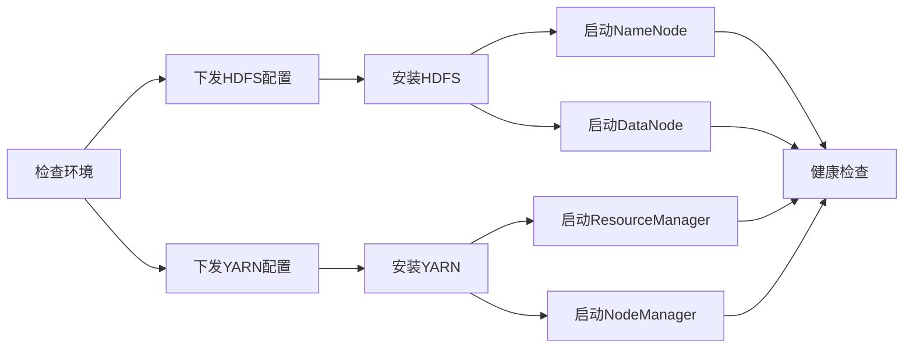
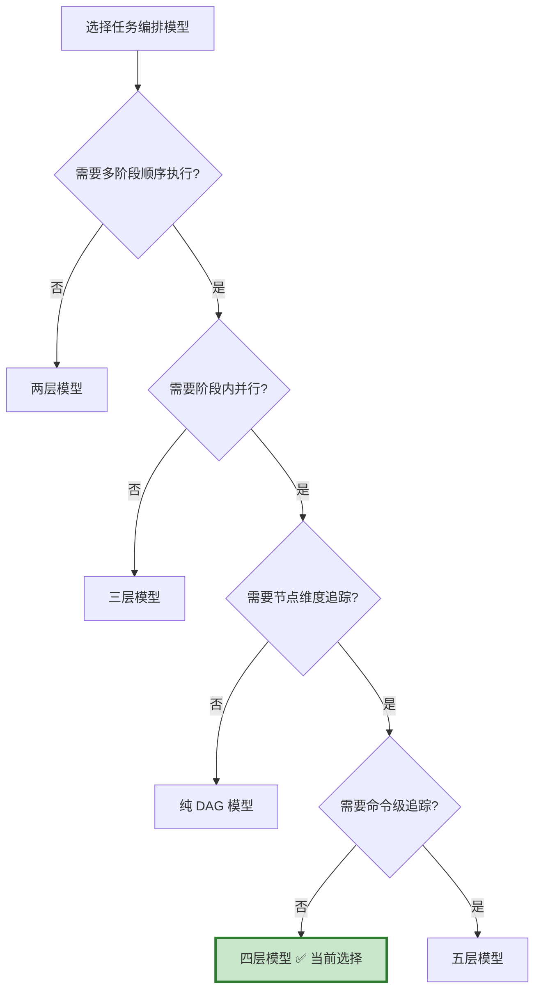

# 四层任务编排模型设计合理性分析与替代方案对比

> **文档版本**：v1.0
> **最后更新**：2026-04-06
> **文档定位**：深入分析当前 Job → Stage → Task → Action 四层任务编排模型的设计合理性，
> 与业界主流的任务编排方案进行详细对比，给出每种方案的优劣势和适用场景。

---

## 目录

- [一、当前四层模型回顾](#一当前四层模型回顾)
- [二、业界主流任务编排模型](#二业界主流任务编排模型)
- [三、方案一：纯 DAG 模型（Airflow / Temporal 风格）](#三方案一纯-dag-模型airflow--temporal-风格)
- [四、方案二：两层模型 Job → Action（扁平化）](#四方案二两层模型-job--action扁平化)
- [五、方案三：三层模型 Job → Step → Action（合并 Stage+Task）](#五方案三三层模型-job--step--action合并-stagetask)
- [六、方案四：当前四层模型 Job → Stage → Task → Action](#六方案四当前四层模型-job--stage--task--action)
- [七、方案五：五层模型（增加 SubAction / Command 层）](#七方案五五层模型增加-subaction--command-层)
- [八、全维度对比矩阵](#八全维度对比矩阵)
- [九、结论：为什么四层模型是当前场景的最优解](#九结论为什么四层模型是当前场景的最优解)
- [十、四层模型的改进建议](#十四层模型的改进建议)

---

## 一、当前四层模型回顾

### 1.1 模型结构

```
Job（一个操作，如"安装集群"）
 └── Stage（操作的一个阶段，Stage 之间顺序执行）
      └── Task（阶段内可并行的子任务）
           └── Action（每个节点具体执行的 Shell 命令）
```

### 1.2 各层职责

| 层级 | 语义 | 执行方式 | 典型数量 | 数据量级 | 示例 |
|------|------|---------|---------|---------|------|
| **Job** | 一个完整的操作流程 | API 触发 | 1 | 千级（累计） | 安装 YARN |
| **Stage** | 操作的一个阶段 | Stage 间**顺序执行** | ~16/Job | 万级 | 下发配置、启动服务 |
| **Task** | 阶段内的子任务 | 同 Stage 内 Task **并行执行** | ~22/Job | 万级 | 配置 HDFS、配置 YARN |
| **Action** | 每个节点的具体命令 | 下发到 Agent 执行 | 数千/Task | **百万级** | `systemctl start yarn` |

### 1.3 典型数据规模

| 集群规模 | Job | Stage | Task | Action | 说明 |
|---------|-----|-------|------|--------|------|
| 100 节点 | 1 | 16 | 22 | ~5,350 | 小型集群 |
| 2000 节点 | 1 | 16 | 22 | ~107,000 | 中型集群 |
| 6000 节点 | 1 | 16 | 22 | ~321,000 | 大型集群 |

### 1.4 核心设计特征

1. **Stage 间顺序执行**：保证阶段间的依赖关系（先下发配置，再启动服务）
2. **Task 间并行执行**：同一阶段内的子任务可以并行（配置 HDFS 和配置 YARN 可以同时进行）
3. **Action 是最小执行单元**：每个 Action 对应一个节点上的一条 Shell 命令
4. **Action 数量爆炸**：Action 数量 = Task 数量 × 节点数量，是系统中数据量最大的实体

---

## 二、业界主流任务编排模型

在分析替代方案之前，先看看业界主流的任务编排系统是怎么设计的：

### 2.1 业界系统概览

| 系统 | 公司/社区 | 模型 | 层级数 | 核心特点 |
|------|----------|------|--------|---------|
| **Apache Airflow** | Airbnb | DAG | 2（DAG → Task） | 纯 DAG，Task 间任意依赖 |
| **Temporal** | Uber | Workflow | 2（Workflow → Activity） | 长时间运行的工作流 |
| **Argo Workflows** | CNCF | DAG | 2（Workflow → Step/Task） | K8s 原生，容器化执行 |
| **Apache DolphinScheduler** | 社区 | DAG | 3（Project → Workflow → Task） | 大数据调度 |
| **Ansible** | RedHat | Playbook | 3（Playbook → Play → Task） | 配置管理/编排 |
| **SaltStack** | VMware | State | 3（State → Module → Function） | 大规模节点管理 |
| **Ambari** | Apache | Blueprint | 4（Request → Stage → Task → HostRoleCommand） | **大数据集群管理** |
| **Cloudera Manager** | Cloudera | Command | 3（Command → Role → HostCommand） | 大数据集群管理 |

### 2.2 关键发现

> **与 TBDS 最相似的系统是 Apache Ambari**，它也是大数据集群管理平台，采用了几乎相同的四层模型：
>
> ```
> Ambari:   Request → Stage → Task → HostRoleCommand
> TBDS:     Job     → Stage → Task → Action
> ```
>
> 这不是巧合——**大数据集群管理场景的特殊性决定了四层模型是自然的选择**。

---

## 三、方案一：纯 DAG 模型（Airflow / Temporal 风格）

### 3.1 模型结构

```
Workflow（工作流）
 └── Task（任务节点，通过 DAG 定义依赖关系）
      └── 直接执行（无独立的"节点命令"概念）
```



### 3.2 映射到 TBDS 场景

```python
# Airflow 风格的 DAG 定义
with DAG("install_yarn", schedule_interval=None) as dag:
    check_env = BashOperator(task_id="check_env", bash_command="check_disk.sh")
    push_hdfs_config = BashOperator(task_id="push_hdfs_config", bash_command="push_config.sh")
    push_yarn_config = BashOperator(task_id="push_yarn_config", bash_command="push_config.sh")
    install_hdfs = BashOperator(task_id="install_hdfs", bash_command="install.sh")
    start_namenode = BashOperator(task_id="start_namenode", bash_command="start_nn.sh")
    # ...

    check_env >> [push_hdfs_config, push_yarn_config]
    push_hdfs_config >> install_hdfs
    push_yarn_config >> install_yarn
    install_hdfs >> [start_namenode, start_datanode]
    # ...
```

### 3.3 优势

| 优势 | 说明 |
|------|------|
| **灵活的依赖关系** | 任意 Task 之间可以定义依赖，不局限于"阶段顺序" |
| **可视化友好** | DAG 图直观展示任务依赖关系 |
| **社区成熟** | Airflow/Temporal 有大量社区支持和最佳实践 |
| **表达力强** | 可以表达条件分支、循环、子工作流等复杂逻辑 |

### 3.4 劣势（为什么不适合 TBDS 场景）

| 劣势 | 说明 | 严重程度 |
|------|------|---------|
| **缺少"节点"维度** | DAG 中的 Task 是逻辑任务，没有"在 6000 个节点上分别执行"的概念。需要在 Task 内部自己处理多节点并发 | 🔴 致命 |
| **数据量爆炸** | 如果把每个节点的每条命令都建模为 DAG 节点，6000 节点 × 50 命令 = 30 万个 DAG 节点，DAG 调度器无法承受 | 🔴 致命 |
| **缺少批量操作语义** | "在所有 DataNode 节点上执行 start 命令"在 DAG 中需要为每个节点创建一个 Task，无法表达"批量"语义 | 🟡 严重 |
| **进度追踪困难** | DAG 只知道 Task 是否完成，不知道"6000 个节点中有多少已经完成" | 🟡 严重 |
| **调度开销大** | DAG 调度器需要维护所有节点的依赖关系图，内存和 CPU 开销巨大 | 🟡 严重 |

### 3.5 核心问题分析

**纯 DAG 模型的根本问题是：它是为"逻辑任务编排"设计的，而不是为"大规模节点命令下发"设计的。**

```
Airflow 的典型场景：
  ETL Pipeline: 抽取数据 → 清洗数据 → 加载数据
  每个 Task 在一台机器上执行，Task 数量 = 几十个

TBDS 的典型场景：
  安装集群: 检查环境 → 下发配置 → 安装软件 → 启动服务
  每个 Task 需要在 6000 台机器上分别执行，Action 数量 = 几十万个
```

DAG 模型缺少一个关键维度：**节点维度（Host Dimension）**。TBDS 的四层模型通过 Task → Action 的展开，天然地将"逻辑任务"映射到"物理节点"。

### 3.6 适用场景

- ✅ 数据 ETL Pipeline（Airflow）
- ✅ 微服务编排（Temporal）
- ✅ CI/CD Pipeline（Argo Workflows）
- ❌ **大规模节点命令下发**（TBDS 场景）

---

## 四、方案二：两层模型 Job → Action（扁平化）

### 4.1 模型结构

```
Job（一个操作）
 └── Action（直接展开为所有节点的所有命令，通过 order_num 控制顺序）
```

### 4.2 映射到 TBDS 场景

```sql
-- 安装 YARN，100 节点
-- 直接生成所有 Action，通过 order_num 分组控制顺序

INSERT INTO action (job_id, order_num, hostuuid, command) VALUES
-- order_num=0: 检查环境（100 个 Action）
(1, 0, 'node-001', 'check_disk.sh'),
(1, 0, 'node-002', 'check_disk.sh'),
...
(1, 0, 'node-100', 'check_disk.sh'),

-- order_num=1: 下发配置（200 个 Action，HDFS+YARN 各 100）
(1, 1, 'node-001', 'push_hdfs_config.sh'),
(1, 1, 'node-001', 'push_yarn_config.sh'),
...

-- order_num=2: 安装软件（100 个 Action）
(1, 2, 'node-001', 'install_hadoop.sh'),
...

-- order_num=3: 启动服务（100 个 Action）
(1, 3, 'node-001', 'start_namenode.sh'),
...
```

### 4.3 优势

| 优势 | 说明 |
|------|------|
| **模型极简** | 只有 2 张表（job + action），数据模型简单 |
| **无中间层开销** | 不需要 Stage/Task 的创建、状态管理、进度检测 |
| **查询简单** | 直接查 action 表就能知道所有信息 |

### 4.4 劣势（为什么不适合 TBDS 场景）

| 劣势 | 说明 | 严重程度 |
|------|------|---------|
| **丢失阶段语义** | 无法表达"先下发配置，再启动服务"的阶段概念，只能用 order_num 模拟 | 🟡 严重 |
| **丢失并行语义** | 无法表达"配置 HDFS 和配置 YARN 可以并行"，只能全部串行或全部并行 | 🟡 严重 |
| **进度追踪粗糙** | 只能追踪整个 Job 的进度（已完成 Action 数 / 总 Action 数），无法按阶段展示 | 🟡 严重 |
| **Action 表膨胀** | 所有信息都堆在 Action 表中，6000 节点一次操作就是 30 万条记录 | 🔴 致命 |
| **无法部分重试** | 如果"启动服务"阶段失败，无法只重试这个阶段，只能重试整个 Job | 🔴 致命 |
| **流程定义困难** | 没有 Stage/Task 的抽象，流程定义只能是一个扁平的 Action 列表，可读性差 | 🟡 严重 |
| **扩展性差** | 新增一个阶段需要修改 order_num 的分配逻辑，容易出错 | 🟡 严重 |

### 4.5 核心问题分析

**两层模型的根本问题是：它丢失了"阶段"和"子任务"的语义抽象，把所有复杂性都压到了 Action 层。**

```
四层模型的流程定义：
  Stage-0: CHECK_ENV       → [CHECK_DISK, CHECK_MEMORY]     ← 清晰的阶段和子任务
  Stage-1: PUSH_CONFIG     → [PUSH_YARN_CONFIG, PUSH_HDFS_CONFIG]
  Stage-2: START_SERVICE   → [START_NN, START_DN, START_RM, START_NM]

两层模型的流程定义：
  order_num=0: check_disk.sh × 100 + check_memory.sh × 100  ← 扁平的 Action 列表
  order_num=1: push_yarn_config.sh × 100 + push_hdfs_config.sh × 100
  order_num=2: start_nn.sh × 3 + start_dn.sh × 97 + start_rm.sh × 3 + start_nm.sh × 97
```

两层模型在小规模场景下可以工作，但在 TBDS 这种"56 种流程 × 6000 节点"的场景下，流程定义和维护的复杂度会急剧上升。

### 4.6 适用场景

- ✅ 简单的批量命令执行（如 Ansible ad-hoc 命令）
- ✅ 节点数量少（<100）的场景
- ✅ 流程简单（<5 个步骤）的场景
- ❌ **复杂的多阶段流程编排**（TBDS 场景）

---

## 五、方案三：三层模型 Job → Step → Action（合并 Stage+Task）

### 5.1 模型结构

```
Job（一个操作）
 └── Step（操作的一个步骤，Step 之间可以定义顺序/并行关系）
      └── Action（每个节点的具体命令）
```

### 5.2 映射到 TBDS 场景

```
Job: 安装 YARN
 ├── Step-0: CHECK_DISK        (顺序) → Action × 100 节点
 ├── Step-1: CHECK_MEMORY      (顺序) → Action × 100 节点
 ├── Step-2: PUSH_YARN_CONFIG  (并行) → Action × 100 节点
 ├── Step-3: PUSH_HDFS_CONFIG  (并行) → Action × 100 节点
 ├── Step-4: INSTALL_HADOOP    (顺序) → Action × 100 节点
 ├── Step-5: START_NAMENODE    (并行) → Action × 3 节点
 ├── Step-6: START_DATANODE    (并行) → Action × 97 节点
 ├── Step-7: START_RM          (并行) → Action × 3 节点
 ├── Step-8: START_NM          (并行) → Action × 97 节点
 └── Step-9: HEALTH_CHECK      (顺序) → Action × 100 节点
```

### 5.3 与四层模型的对比

```
四层模型：
  Stage-0: CHECK_ENV
    ├── Task: CHECK_DISK    → Action × 100
    └── Task: CHECK_MEMORY  → Action × 100
  Stage-1: PUSH_CONFIG
    ├── Task: PUSH_YARN     → Action × 100
    └── Task: PUSH_HDFS     → Action × 100

三层模型（合并 Stage+Task）：
  Step-0: CHECK_DISK    (group=CHECK_ENV, parallel=true)  → Action × 100
  Step-1: CHECK_MEMORY  (group=CHECK_ENV, parallel=true)  → Action × 100
  Step-2: PUSH_YARN     (group=PUSH_CONFIG, parallel=true) → Action × 100
  Step-3: PUSH_HDFS     (group=PUSH_CONFIG, parallel=true) → Action × 100
```

### 5.4 优势

| 优势 | 说明 |
|------|------|
| **模型更简单** | 3 张表（job + step + action），比四层少一层 |
| **减少中间状态管理** | 不需要同时管理 Stage 和 Task 两层的状态 |
| **进度追踪更直接** | 每个 Step 直接关联 Action，进度计算更简单 |
| **DB 查询更少** | 少一层 JOIN，查询性能更好 |

### 5.5 劣势

| 劣势 | 说明 | 严重程度 |
|------|------|---------|
| **丢失"阶段"语义** | "检查环境"是一个阶段，包含"检查磁盘"和"检查内存"两个子任务。三层模型中这个阶段概念被打散了 | 🟡 中等 |
| **Step 数量膨胀** | 原来 16 个 Stage × 平均 1.4 个 Task = 22 个 Task，三层模型变成 22 个 Step。Step 数量增加，管理复杂度上升 | 🟡 中等 |
| **并行控制复杂** | 需要额外的 `group` 字段来表达"哪些 Step 可以并行"，不如四层模型中"同 Stage 内 Task 并行"来得自然 | 🟡 中等 |
| **流程定义可读性下降** | 56 种流程定义中，每种流程的 Step 数量更多，可读性不如"Stage → Task"的两级结构 | 🟢 轻微 |
| **部分重试粒度不够** | 如果"下发配置"阶段的"PUSH_YARN"失败了，四层模型可以只重试这个 Task；三层模型需要重试整个 Step（或者引入额外的重试逻辑） | 🟡 中等 |

### 5.6 核心问题分析

**三层模型的核心问题是：它把"阶段"和"子任务"两个不同维度的概念合并到了一层，导致需要额外的元数据（group、parallel_flag）来弥补丢失的语义。**

```
四层模型的语义：
  Stage = 阶段（顺序执行的单位）
  Task  = 子任务（并行执行的单位）
  → 两个维度正交，各自独立

三层模型的语义：
  Step = 阶段 + 子任务（混合）
  → 需要 group 字段区分"哪些 Step 属于同一阶段"
  → 需要 parallel_flag 字段区分"哪些 Step 可以并行"
  → 本质上是把四层模型的结构信息编码到了字段中
```

**这是一个经典的"层级 vs 属性"的设计权衡**：
- 四层模型：通过层级结构表达语义（Stage 包含 Task）
- 三层模型：通过属性标记表达语义（Step 有 group 和 parallel_flag）

在 TBDS 这种"56 种流程、每种流程 16 个阶段"的场景下，层级结构的可读性和可维护性更好。

### 5.7 适用场景

- ✅ 流程简单（<10 个步骤）的场景
- ✅ 不需要"阶段"概念的场景（如 CI/CD Pipeline）
- ✅ 团队规模小，希望减少模型复杂度
- ⚠️ **可以用于 TBDS 场景，但需要额外的 group/parallel 机制来弥补语义损失**

---

## 六、方案四：当前四层模型 Job → Stage → Task → Action

### 6.1 模型结构（回顾）

```
Job（一个操作，如"安装集群"）
 └── Stage（操作的一个阶段，Stage 之间顺序执行）
      └── Task（阶段内可并行的子任务）
           └── Action（每个节点具体执行的 Shell 命令）
```

### 6.2 为什么是四层？

四层模型的每一层都有**不可替代的语义**：

| 层级 | 语义维度 | 为什么不能去掉 |
|------|---------|---------------|
| **Job** | 操作维度 | 用户操作的入口，一个 Job 对应一个用户意图（"安装 YARN"） |
| **Stage** | 阶段维度 | 表达阶段间的**顺序依赖**（先下发配置，再启动服务）。去掉 Stage，就丢失了阶段概念 |
| **Task** | 子任务维度 | 表达阶段内的**并行能力**（配置 HDFS 和配置 YARN 可以同时进行）。去掉 Task，就丢失了并行语义 |
| **Action** | 节点维度 | 表达**物理节点**上的具体命令。去掉 Action，就无法追踪每个节点的执行状态 |

```
四层模型的四个维度：
  Job    → 操作维度（What：做什么操作）
  Stage  → 阶段维度（When：什么时候做，阶段间顺序）
  Task   → 子任务维度（How：怎么做，阶段内并行）
  Action → 节点维度（Where：在哪里做，具体节点）
```

### 6.3 优势

| 优势 | 说明 |
|------|------|
| **语义清晰** | 四层分别对应操作、阶段、子任务、节点命令，每层职责明确 |
| **天然支持顺序+并行** | Stage 间顺序、Task 间并行，不需要额外的标记字段 |
| **进度追踪精细** | 可以按 Job/Stage/Task/Action 四个粒度追踪进度 |
| **部分重试** | 可以只重试某个 Task 或某个 Stage，不需要重试整个 Job |
| **流程定义可读** | Stage → Task 的两级结构，56 种流程定义清晰可维护 |
| **与 Ambari 一致** | 业界最成熟的大数据集群管理系统 Ambari 采用相同的四层模型 |
| **扩展性好** | 新增阶段只需添加 Stage 模板，新增子任务只需添加 TaskProducer |

### 6.4 劣势

| 劣势 | 说明 | 严重程度 |
|------|------|---------|
| **模型复杂** | 4 张核心表，状态管理涉及 4 层状态机 | 🟡 中等 |
| **中间层开销** | Stage 和 Task 的创建、状态更新、进度检测都有 DB 开销 | 🟡 中等 |
| **Action 表膨胀** | Action 表是百万级热点表，需要专门优化（覆盖索引、冷热分离） | 🟡 中等 |
| **进度检测链路长** | Action 完成 → Task 进度 → Stage 进度 → Job 进度，链路较长 | 🟢 轻微 |
| **Stage 间严格顺序** | 不支持 Stage 间的部分并行（如 Stage-2 和 Stage-3 可以同时执行） | 🟢 轻微 |

### 6.5 劣势的应对方案

| 劣势 | 应对方案 | 文档参考 |
|------|---------|---------|
| 模型复杂 | 通过 Module 接口统一管理，代码结构清晰 | 01-总体设计.md |
| 中间层开销 | Kafka 事件驱动替代轮询，减少 DB 查询 | 痛难点优化分析.md |
| Action 表膨胀 | 覆盖索引 + 冷热分离 + 批量聚合 | 痛难点优化分析.md |
| 进度检测链路长 | 事件驱动的级联通知（Action→Task→Stage→Job） | 08-微服务拆分设计.md |
| Stage 间严格顺序 | 可扩展为 Stage DAG（Stage 间也支持并行） | 下文改进建议 |

---

## 七、方案五：五层模型（增加 SubAction / Command 层）

### 7.1 模型结构

```
Job（一个操作）
 └── Stage（操作的一个阶段）
      └── Task（阶段内的子任务）
           └── Action（每个节点的执行单元）
                └── Command（Action 内的具体命令步骤）
```

### 7.2 动机

当前四层模型中，一个 Action 对应一条 Shell 命令。但实际场景中，一个 Action 可能需要执行多个步骤：

```
Action: 安装 YARN NodeManager
  Command-1: 下载安装包（wget ...）
  Command-2: 解压安装包（tar -xzf ...）
  Command-3: 配置环境变量（echo "export ..." >> /etc/profile）
  Command-4: 启动服务（systemctl start ...）
```

### 7.3 优势

| 优势 | 说明 |
|------|------|
| **更细粒度的追踪** | 可以知道 Action 内部执行到了哪一步 |
| **更精确的重试** | 可以从失败的 Command 开始重试，而不是重试整个 Action |
| **更好的日志关联** | 每个 Command 有独立的 stdout/stderr |

### 7.4 劣势（为什么不适合 TBDS 场景）

| 劣势 | 说明 | 严重程度 |
|------|------|---------|
| **数据量再次爆炸** | 如果每个 Action 有 4 个 Command，30 万 Action × 4 = 120 万 Command | 🔴 致命 |
| **模型过度复杂** | 5 层模型的状态管理、进度检测、重试逻辑都更加复杂 | 🔴 致命 |
| **收益不大** | 当前 Action 的 commandJson 已经可以包含多步骤脚本，Agent 端顺序执行即可 | 🟡 中等 |
| **Agent 端复杂度上升** | Agent 需要管理 Command 级别的状态和上报 | 🟡 中等 |

### 7.5 核心问题分析

**五层模型的根本问题是：过度设计。当前 Action 的 commandJson 已经可以包含复杂的 Shell 脚本，Agent 端作为一个"命令执行器"，不需要感知脚本内部的步骤。**

```
当前方案（四层 + 复合命令）：
  Action.commandJson = {
    "command": "wget ... && tar -xzf ... && echo 'export ...' >> /etc/profile && systemctl start ...",
    "timeout": 300
  }
  → Agent 执行一条复合命令，返回最终结果

五层方案：
  Action → Command-1: wget ...
         → Command-2: tar -xzf ...
         → Command-3: echo 'export ...' >> /etc/profile
         → Command-4: systemctl start ...
  → Agent 逐条执行，逐条上报
  → Server 需要管理 120 万条 Command 记录
```

**复合命令的方式更简单、更高效，且满足当前需求。** 如果未来确实需要 Command 级别的追踪，可以通过 Action 的 `stdout` 字段中的结构化日志来实现，而不需要增加一层数据模型。

### 7.6 适用场景

- ✅ 需要极细粒度追踪的场景（如合规审计）
- ✅ 每个 Command 有不同的超时和重试策略
- ❌ **大规模节点场景**（数据量爆炸）

---

## 八、全维度对比矩阵

### 8.1 功能维度对比

| 维度 | 纯 DAG | 两层 | 三层 | **四层（当前）** | 五层 |
|------|--------|------|------|-----------------|------|
| 阶段顺序执行 | ✅ DAG 依赖 | ⚠️ order_num | ⚠️ group+order | ✅ **Stage 天然支持** | ✅ Stage 天然支持 |
| 阶段内并行 | ✅ DAG 依赖 | ❌ 无法表达 | ⚠️ parallel_flag | ✅ **Task 天然支持** | ✅ Task 天然支持 |
| 节点维度追踪 | ❌ 无 | ✅ Action | ✅ Action | ✅ **Action** | ✅ Action+Command |
| 进度追踪粒度 | Task 级 | Job 级 | Step 级 | **Job/Stage/Task/Action 四级** | 五级 |
| 部分重试 | ✅ Task 级 | ❌ 只能重试 Job | ⚠️ Step 级 | ✅ **Task 级** | ✅ Command 级 |
| 流程定义可读性 | ✅ DAG 图 | ❌ 扁平列表 | ⚠️ 中等 | ✅ **Stage→Task 两级** | ⚠️ 过于复杂 |
| 条件分支 | ✅ Gateway | ❌ 不支持 | ⚠️ 需扩展 | ⚠️ **需扩展** | ⚠️ 需扩展 |

### 8.2 性能维度对比

| 维度 | 纯 DAG | 两层 | 三层 | **四层（当前）** | 五层 |
|------|--------|------|------|-----------------|------|
| 核心表数量 | 2 | 2 | 3 | **4** | 5 |
| 6000 节点 Action 数 | 30 万 DAG 节点 | 30 万 | 30 万 | **30 万** | 120 万 |
| DB 写入量 | 极高 | 低 | 中 | **中** | 极高 |
| 状态管理复杂度 | 高（DAG 依赖） | 低 | 中 | **中** | 高 |
| 进度检测 DB 查询 | 多（DAG 遍历） | 少（1 层） | 中（2 层） | **中（3 层）** | 多（4 层） |
| 内存占用 | 高（DAG 图） | 低 | 中 | **中** | 高 |

### 8.3 工程维度对比

| 维度 | 纯 DAG | 两层 | 三层 | **四层（当前）** | 五层 |
|------|--------|------|------|-----------------|------|
| 实现复杂度 | 高 | 低 | 中 | **中** | 高 |
| 维护成本 | 中 | 低 | 中 | **中** | 高 |
| 扩展性 | 高 | 低 | 中 | **高** | 高 |
| 团队学习成本 | 高 | 低 | 中 | **中** | 高 |
| 业界参考 | Airflow/Temporal | 无 | Cloudera Manager | **Ambari** | 无 |
| 社区成熟度 | 高 | 低 | 中 | **高（Ambari）** | 低 |

### 8.4 综合评分（满分 5 分）

| 维度 | 纯 DAG | 两层 | 三层 | **四层（当前）** | 五层 |
|------|--------|------|------|-----------------|------|
| 功能完备性 | 4 | 1 | 3 | **5** | 5 |
| 性能效率 | 2 | 4 | 4 | **4** | 2 |
| 工程简洁性 | 3 | 5 | 4 | **3** | 2 |
| 场景匹配度 | 2 | 1 | 3 | **5** | 3 |
| 可维护性 | 3 | 3 | 4 | **4** | 2 |
| **总分** | **14** | **14** | **18** | **21** | **14** |

---

## 九、结论：为什么四层模型是当前场景的最优解

### 9.1 核心结论

> **四层模型（Job → Stage → Task → Action）是大数据集群管理场景下的最优解。**
>
> 这不是偶然的设计选择，而是由业务场景的特殊性决定的：
> 1. **多阶段顺序依赖**（Stage 层的必要性）
> 2. **阶段内并行能力**（Task 层的必要性）
> 3. **大规模节点命令下发**（Action 层的必要性）
> 4. **精细化进度追踪和部分重试**（四层结构的优势）

### 9.2 为什么不选其他方案？



| 排除方案 | 排除原因 |
|---------|---------|
| 纯 DAG | 缺少节点维度，30 万 DAG 节点调度器无法承受 |
| 两层 | 丢失阶段和并行语义，无法部分重试 |
| 三层 | 可行但需要额外的 group/parallel 机制弥补语义损失，不如四层自然 |
| 五层 | 过度设计，数据量爆炸（120 万 Command），收益不大 |

### 9.3 业界验证

**Apache Ambari** 是 Apache 基金会的大数据集群管理项目，被 Hortonworks（现 Cloudera）广泛使用，管理数千节点的 Hadoop 集群。它采用了几乎相同的四层模型：

```
Ambari:                          TBDS:
Request (请求)                   Job (操作)
 └── Stage (阶段)                └── Stage (阶段)
      └── Task (任务)                 └── Task (子任务)
           └── HostRoleCommand            └── Action (节点命令)
               (节点角色命令)
```

**两个独立开发的系统，面对相同的业务场景，得出了相同的架构设计。** 这是四层模型合理性的最好证明。

### 9.4 一句话总结

> **四层模型的每一层都对应一个不可替代的业务维度（操作、阶段、子任务、节点命令），
> 去掉任何一层都会丢失关键语义，增加任何一层都会带来不必要的复杂度。
> 它是"刚好够用"的设计，不多也不少。**

---

## 十、四层模型的改进建议

虽然四层模型是最优解，但仍有改进空间：

### 10.1 改进一：Stage 间支持部分并行（Stage DAG）

**当前限制**：Stage 之间严格顺序执行。

**改进方案**：允许 Stage 之间定义 DAG 依赖关系，部分 Stage 可以并行。

```
当前（严格顺序）：
  Stage-0 → Stage-1 → Stage-2 → Stage-3 → Stage-4 → Stage-5

改进后（Stage DAG）：
  Stage-0 (检查环境)
    ├── Stage-1 (下发HDFS配置) ──→ Stage-3 (启动HDFS)
    └── Stage-2 (下发YARN配置) ──→ Stage-4 (启动YARN)
                                         └──→ Stage-5 (健康检查)
```

**实现方式**：Stage 表增加 `depends_on` 字段（JSON 数组），存储依赖的 Stage ID 列表。

```go
type Stage struct {
    // ... 现有字段 ...
    DependsOn []string `gorm:"column:depends_on;type:text"` // 依赖的 Stage ID 列表
}
```

**收益**：HDFS 配置和 YARN 配置可以并行下发，缩短整体执行时间。

**风险**：增加调度复杂度，需要实现 DAG 拓扑排序和并行度控制。

### 10.2 改进二：Action 表拆分（读写分离）

**当前问题**：Action 表既存储命令定义（command_json），又存储执行结果（stdout/stderr），导致表膨胀。

**改进方案**：将 Action 表拆分为 `action`（命令定义）和 `action_result`（执行结果）。

```sql
-- action 表（轻量，用于下发）
CREATE TABLE action (
    id BIGINT PRIMARY KEY,
    action_id VARCHAR(128),
    task_id BIGINT,
    hostuuid VARCHAR(128),
    command_json TEXT,
    state INT,
    createtime DATETIME
);

-- action_result 表（重量，用于存储结果）
CREATE TABLE action_result (
    id BIGINT PRIMARY KEY,
    action_id BIGINT,
    exit_code INT,
    stdout TEXT,
    stderr TEXT,
    endtime DATETIME
);
```

**收益**：
- `action` 表更轻量，RedisActionLoader 扫描更快
- `action_result` 表可以独立做冷热分离
- 读写分离，减少锁竞争

### 10.3 改进三：引入 Action 模板（减少重复数据）

**当前问题**：同一个 Task 的 6000 个 Action，command_json 几乎相同（只是 hostuuid 不同），造成大量数据冗余。

**改进方案**：引入 `action_template` 表，Action 只存储模板 ID 和节点信息。

```sql
-- action_template 表（命令模板）
CREATE TABLE action_template (
    id BIGINT PRIMARY KEY,
    task_id BIGINT,
    command_template TEXT,  -- 命令模板，如 "systemctl start {service}"
    variables TEXT          -- 变量定义，如 {"service": "hadoop-yarn-nodemanager"}
);

-- action 表（轻量化）
CREATE TABLE action (
    id BIGINT PRIMARY KEY,
    template_id BIGINT,    -- 关联模板
    hostuuid VARCHAR(128), -- 目标节点
    state INT,
    createtime DATETIME
);
```

**收益**：
- Action 表数据量大幅减少（去掉了重复的 command_json）
- 修改命令只需更新模板，不需要更新所有 Action
- DB 存储空间节省 60%+

### 10.4 改进优先级

| 改进 | 优先级 | 收益 | 实现难度 | 建议 |
|------|--------|------|---------|------|
| Action 表拆分 | P0 | 高 | 低 | **立即实施** |
| Action 模板 | P1 | 高 | 中 | 第二阶段实施 |
| Stage DAG | P2 | 中 | 高 | 按需实施 |

---

## 附录：决策记录

### 为什么选择四层模型？

| 决策因素 | 权重 | 四层模型得分 | 说明 |
|---------|------|------------|------|
| 业务场景匹配度 | 30% | 5/5 | 完美匹配大数据集群管理的多阶段、多节点场景 |
| 功能完备性 | 25% | 5/5 | 支持顺序执行、并行执行、精细进度追踪、部分重试 |
| 性能可接受性 | 20% | 4/5 | Action 表膨胀是已知问题，有成熟的优化方案 |
| 工程可维护性 | 15% | 4/5 | 四层结构清晰，56 种流程定义可读性好 |
| 业界验证 | 10% | 5/5 | Apache Ambari 采用相同模型，经过大规模生产验证 |
| **加权总分** | 100% | **4.65/5** | |

### 关键参考

| 参考系统 | 模型 | 规模 | 说明 |
|---------|------|------|------|
| Apache Ambari | 4 层（Request→Stage→Task→HostRoleCommand） | 数千节点 | 最接近的参考 |
| Cloudera Manager | 3 层（Command→Role→HostCommand） | 数千节点 | 三层也可行，但语义不如四层清晰 |
| Apache Airflow | 2 层（DAG→Task） | 逻辑任务 | 不适合大规模节点场景 |
| Kubernetes | 3 层（Deployment→ReplicaSet→Pod） | 容器编排 | 不同领域，但层级思想类似 |
